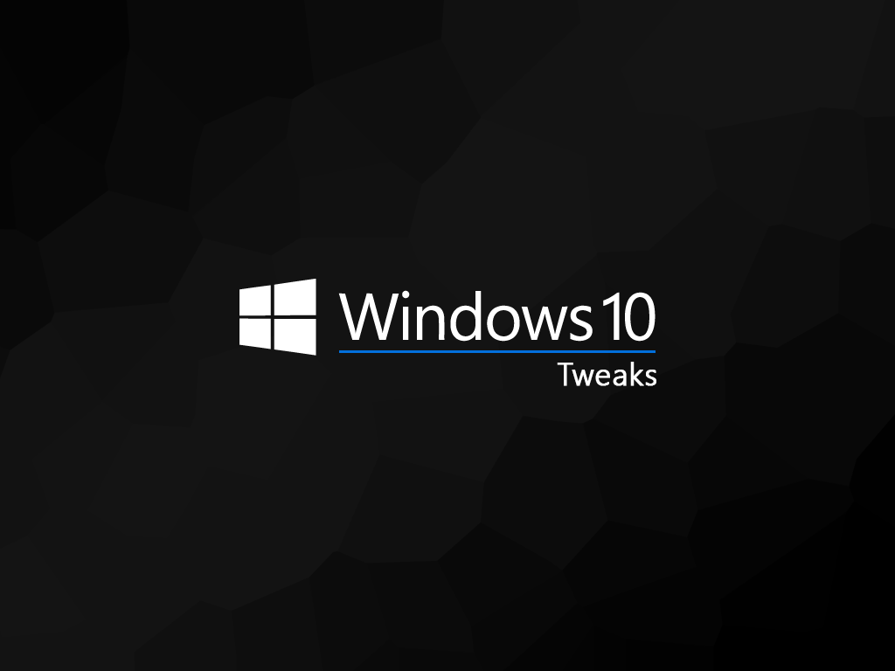

# Windows 10 Tweaks - 1909 Update

## Disclaimer

Let's be honest, Windows has become a mammoth of an OS that is generically geared toward everyone. My goal with this set of scripts is to put the User back in control of the OS. That said, these scripts have been heavily customized to my own personal needs, it is highly recommended that if you are to use them you review them in their entirety first.

*This repository is provided for archival/educational purposes, I am not responsible for any data loss or damage that may ensue.*

## Introduction

This script is meant to be utilized immediately after a fresh installation of Windows 10. Before the script can be run, Windows itself needs to be installed properly. The following will walk you through setting up Windows 10 with a local user account. This guide can also be adapted to be used with a Domain Account, however Microsoft Accounts will not work.

## Features

## Windows 10 Tweaks Guide

### Installation

While this can be used with any version of Windows 10, this guide revolves around Windows 10 Pro for Workstations.

After installing Windows to the selected hard drive you will be prompted to reboot the computer. Upon completion you will begin the configuration of Windows. Begin by selecting a region and keyboard.

Designate that you are setting up a `personal account`:

On the Sign In with Microsoft screen, select `Offline account`.

Confirm that you wish you use an offline account.

Choose a username and password for your login information, when prompted to share activity across devices choose `No`.

When asked if you would like to receive help from Cortana choose `Decline`.

Finally on the privacy settings screen, make sure you deselect every single option (scroll down for more options). Only after you have turned off all of Microsoft's tracking should you select `Accept` to complete the Windows 10 configuration.

### Windows Update

Eventually you will be able to login and will be presented with the desktop. Click on the notification icon to the right of the clock in the system tray (bottom right corner of screen). From here you will want to select `All settings`.

Navigate to `Update & Security`.

From here update Windows, you need to continue to check for updates after every update until Windows tells you that `You're up to date`.

Don't forget to also install optional updates.

This will most likely require a reboot or a few. Once complete open the Windows Store from the taskbar (the briefcase with the Windows logo on it). Open the extras menu and select `Downloads and updates`.

Make sure to utilize both the `Get updates` and `Update all` buttons.

Verify that you have performed all updates by the store telling you `You're good to go`.

At this point the only thing left to do (if it has not been done already) is to activate Windows.

### Tweaks

With the computer configured and updated it is now time to run the script. Make sure you have downloaded the script from GitHub.

Assuming the scripts have been extracted to your Desktop... Open the start menu and search for `cmd`, this should bring up the listing for Command Prompt. Make sure you choose the option on the right `Run as administrator`.

Change directory into the extracted folder `cd %USERPROFILE%\Desktop\win10tweak`. Finally run the script.

The script will take quite a while to finish, upon completion it will reboot automatically. After the reboot the last part of the script will run automatically and then remove itself.

### Configuring Windows

Right-click on the desktop and choose `Personalize`. Set the mouse cursor theme to `Snow Leopard` and the color set to a custom color of `#191919` (Dark gray).

OpenShell, which is the new version of ClassicShell should be on the desktop with a settings XML file. Install, removing Classic Explorer and Classic IE (do not install these). After installation click on the Start Menu in order to open the Settings for Open-Shell Menu dialog. Select `Backup` and then `Load from an XML file...` choosing the provided XML file on the desktop.

Select `OK` to save the changes.

## Attribution & References

Without all of the following this guide would not have been possible.

* [Windows 10 Privacy Guide - 1903 Update](https://github.com/adolfintel/Windows10-Privacy)
* [tweaks & fixes for windows 10 - mostly powershell](https://github.com/equk/windows)
* [Win10 Initial Setup Script](https://github.com/Disassembler0/Win10-Initial-Setup-Script)
* [Windows TenForums](https://www.tenforums.com/)
* [Flat-Remix Icon Theme](https://github.com/daniruiz/flat-remix)
* [agave font](https://github.com/agarick/agave)
* [Mixed wallpaper](https://www.deviantart.com/i5yal/art/Mixed-wallpaper-744877376)
